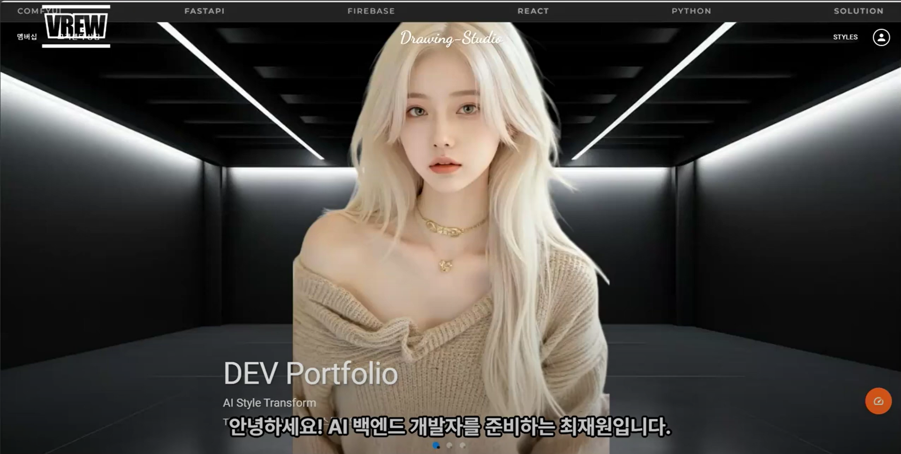
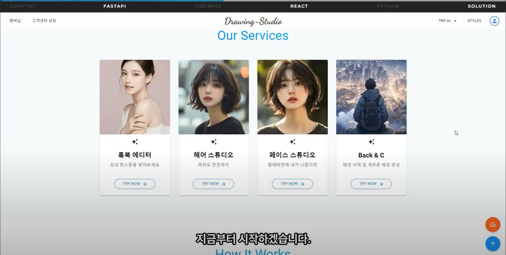
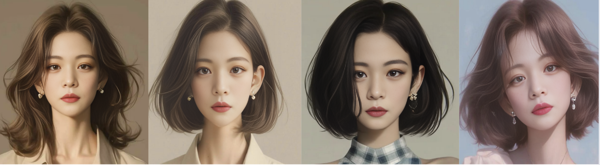
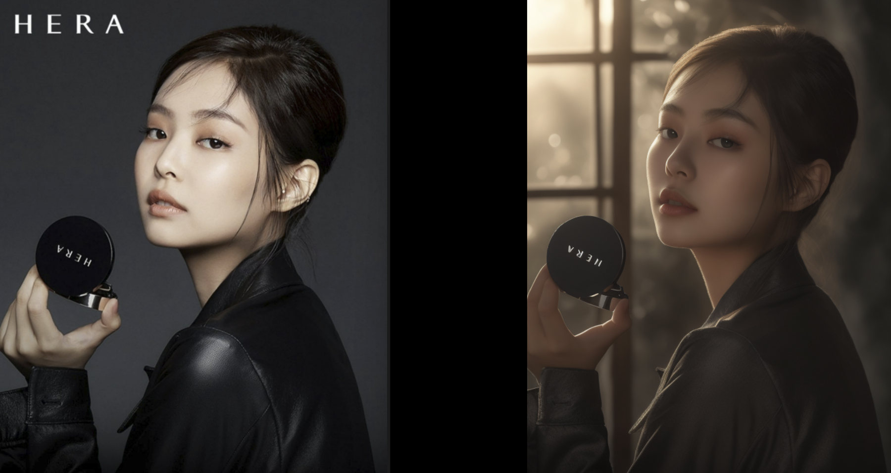

# 💇‍♀️ 헤어디자이너의 AI 혁명: CHOI-AI_Solution 🤖




## 프로젝트 소개

헤어 디자이너의 창의성과 AI 기술의 만남, CHOI-AI_Solution은 개인의 경험에서 탄생한 혁신적인 웹 애플리케이션입니다. 혼자 진행한 사이드 프로젝트로, 미용 전문가와 일반 사용자 모두를 위한 다양한 AI 기반 서비스를 제공합니다.

---

## 🌟 주요 기능 분석


(프로미스 나인 채영님의 헤어스타일 변환)
### 1. AI 헤어스타일 변환 
* **기능**: 사용자 이미지에 다양한 헤어스타일을 AI로 자동 적용
* **특징**:
   * ComfyUI 통합으로 고품질 헤어스타일 렌더링
   * 4가지 스타일 동시 생성 및 비교 기능
   * 얼굴 복원 강도 조절로 자연스러운 결과물 제공
* **추가 설명**: 
   * 미용실 디자이너들을 위한 실용적 도구! 
   * 고객 상담 시 매일 똑같은 머리 스타일을 반복 제안하는 대신, 다양한 스타일을 실시간으로 시연
   * "오늘은 어떤 스타일로 해볼까요?"라는 질문에 시각적으로 명확한 답변 제공


### 2. AI 롤모델로 변환
* **기능**: 사용자 얼굴을 다른 롤모델로로 변환
* **버전**:
   * **Standard**: 기본적인 얼굴 변환 기능 제공
   * **Pro**: 서비스 제한
* **특징**: 사용 내역 저장, 즐겨찾기 기능, 일일 사용량 제한
* **추가 설명**:
   * "나도 롤모델이 될 수 있다!" 
   * 꿈꿔왔던 스타일로 변신하여 새로운 자신감 발견
   * 완벽한 얼굴 변환으로 SNS에서 감탄을 자아내는 프로필 사진 제작


### 3. 배경 처리 서비스 
* **BackClear**:
   * 이미지에서 배경을 자동으로 제거하고 투명 배경으로 전환
   * 고성능 AI 세그멘테이션으로 정확한 경계 검출
* **BackCreate**:
   * 텍스트 프롬프트로 새로운 AI 생성 배경 적용
   * 사용자 이미지와 배경의 자연스러운 합성
* **추가 설명**:
   * 인스타 사진에 MZ 감성 한 스푼!
   * 평범한 셀카도 감각적인 배경으로 분위기 전환
   * 텍스트 한 줄로 원하는 배경을 자유롭게 연출

 
### 3-1. 배경 처리 서비스 (블랙핑크 제니님의 HERA 화장품 광고사진)
* **배경 처리**:
   * 배경 생성으로 AI 광고 시너지 효과
   * 배경과 인물,소품의 조화

### 4. AI 챗봇 & 1:1 상담 (ServiceChat)
* **AI 상담**:
   * Ollama 기반 AI 챗봇으로 즉각적인 고객 응대
   * 이미지 처리 및 서비스 관련 질문에 특화된 응답
* **1:1 상담**:
   * 실시간 WebSocket 통신을 통한 관리자 연결
   * 관리자 온라인 상태 표시 및 상담 이력 저장

### 5. 멤버십 및 결제 시스템
* 카카오페이 결제 연동으로 편리한 결제 프로세스
* 스탠다드/프로 플랜 구분으로 차별화된 서비스 제공
* 결제 상태에 따른 기능 접근 제어

---

## 🔧 기술 스택

### 프론트엔드
* **프레임워크**: React
* **UI 라이브러리**: Material-UI
* **상태 관리**: Redux
* **API 통신**: Axios

### 백엔드
* **서버**: FastAPI (Python)
* **실시간 통신**: WebSocket
* **데이터베이스**: Firebase
* **테스트 도구**: Postman

### AI & 클라우드
* **이미지 처리**: ComfyUI
* **AI 챗봇**: Ollama
* **인증 & 데이터**: Firebase Authentication, Firestore
* **결제 시스템**: 카카오페이 API

### DevOps
* **버전 관리**: Git
* **API 테스트**: Postman
* **배포**: Firebase Hosting

---

## 📱 크로스 플랫폼 최적화
* **완벽한 반응형 디자인**: 웹, 모바일 환경에서 일관된 사용자 경험
* **화면 크기 무관 고품질 이미지**: 디바이스에 상관없이 선명한 UI

---

## 🚀 시작하기

```bash
# 레포지토리 클론
git clone https://github.com/your-username/choi-project.git

# 의존성 설치
npm install

# 개발 서버 실행
npm start
```

---

## 💳 사용 방식 및 정보

### 사용자
* 각 기능(배경 제거/생성, 헤어스타일 변환, 얼굴 변환)당 최대 2회 무료 사용 가능
* 무료 사용 시 워터마크가 포함된 이미지만 다운로드 가능
* AI 챗봇 기본 기능 접근 가능


### 구독 플랜
* **스탠다드 플랜**: 9,900원/월 - 기본 기능 무제한 사용, 워터마크 제거 (개발중)
* **프로 플랜**: 19,900원/월 - 모든 Pro 기능 사용, 우선순위 지원 (개발중)

---

## 🔮 향후 계획
* **GPU 업그레이드 (RTX 4070)**: 더 빠른 이미지 생성 및 처리 속도 제공
* **AI 숏폼 생성**: 생성된 이미지를 활용한 숏폼 비디오 자동 제작 기능
* **미용인 커뮤니티**: 헤어 디자이너와 미용 전문가들을 위한 소통 플랫폼 구축
* **지속적인 AI 기능 고도화**: 더 자연스럽고 다양한 스타일 옵션 추가
* **사용자 피드백 기반 서비스 개선**: UX/UI 지속적 개선

---

## 💡 프로젝트 동기
이 프로젝트는 헤어 디자인 분야의 전문가로서 AI 기술을 접목하여 미용 업계에 혁신을 가져오고자 하는 의도에서 시작되었습니다. 개인 사이드 프로젝트로 개발되었으며, 디자이너와 고객 모두에게 새로운 가능성을 제시하고자 합니다.

---

## 🤝 기여 및 피드백
아이디어와 개선 제안을 환영합니다! 언제든 이슈 트래커를 통해 의견 공유 가능합니다.

---

*💡 헤어 디자인의 새로운 혁신, CHOI-AI_Solution*
